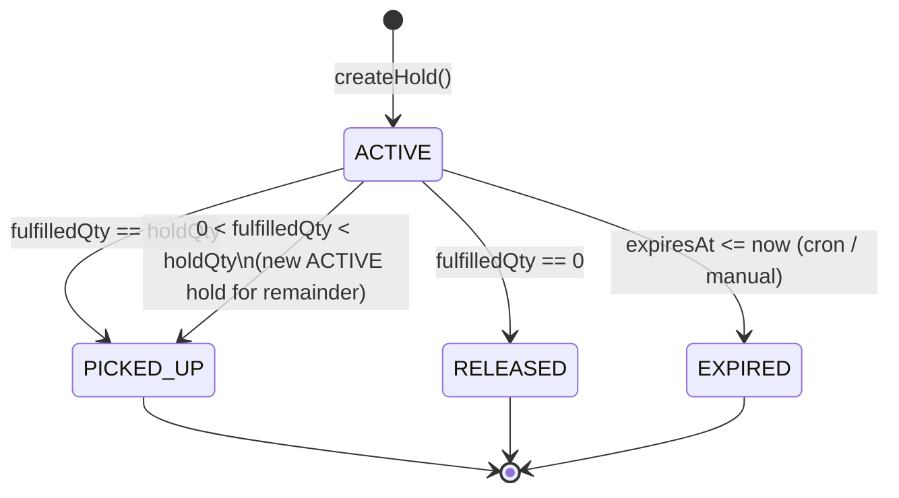
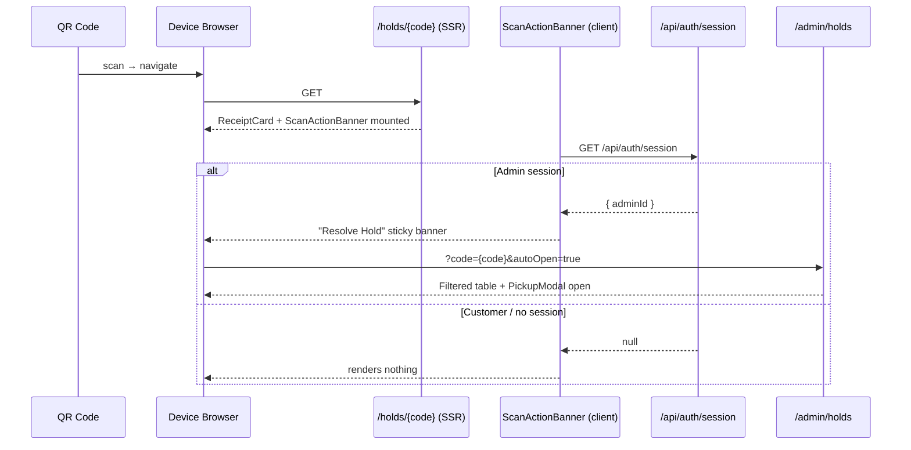

# Jays Shop — Physical Hold Tag & QR Pickup Workflow
## Implementation Plan

> Generated: 2026-05-26  
> Scope: 6 Subsystems — Print Tags, QR Resolution, Hold Actions, Inventory Sync, Auto-Expiration, Stadium Queue

---

## Table of Contents
1. [Investigation Summary](#1-investigation-summary)
2. [Architecture Decisions](#2-architecture-decisions)
3. [Implementation Phases](#3-implementation-phases)
4. [File Change Map](#4-file-change-map)
5. [Verification & Testing Strategy](#5-verification--testing-strategy)
6. [Risk Assessment](#6-risk-assessment)

---

## 1. Investigation Summary

### Current Hold System

| Layer | File | Key Responsibility |
|---|---|---|
| Schema | `prisma/schema.prisma` | `Hold`, `HoldHistory`, `SalesHistory`, `SizeInventory` models |
| Core Logic | `src/lib/holds/createHold.ts` | Creates hold, reserves inventory atomically |
| Core Logic | `src/lib/holds/resolveHold.ts` | Resolves hold (PICKED_UP / RELEASED / EXPIRED), syncs inventory |
| API – Admin | `src/app/api/admin/holds/route.ts` | LIST with filters; stadium queue mode |
| API – Admin | `src/app/api/admin/holds/[id]/resolve/route.ts` | PATCH with fulfilledQty |
| API – Public | `src/app/api/holds/[reservationId]/route.ts` | GET + PATCH by reservationCode |
| API – Cron | `src/app/api/cron/expire-holds/route.ts` | Batch expiry, CRON_SECRET auth |
| UI – Admin | `src/app/(admin)/admin/holds/page.tsx` | Table with Pick Up / Release; Stadium Queue tab |
| UI – Public | `src/app/(public)/holds/[reservationId]/page.tsx` | Receipt page (by reservationCode) |
| UI – Public | `src/app/(public)/my-holds/page.tsx` | Phone-lookup hold list |
| Component | `src/components/holds/ReceiptCard.tsx` | Full receipt with QR code |
| Component | `src/components/holds/QRCodeDisplay.tsx` | QRCodeSVG wrapper (qrcode.react v4.2 installed) |

### Current QR Encoding
```
QRCodeDisplay value = `${appUrl}/holds/${reservationCode}`
```
Encodes the **public** receipt URL. Staff and customers scan to the same page.

### Existing Statuses
`ACTIVE → PICKED_UP | RELEASED | EXPIRED`

Partial pickup: original hold becomes `PICKED_UP` (for fulfilledQty), a **new** `ACTIVE` hold is created for the remainder. `HoldHistory.fulfilledQuantity < holdQuantity` marks it as partial.

### Stadium Hold Fields Already in Schema
- `isStadiumHold: Boolean`
- `pickupQueueAt: DateTime?` — 30 min after creation
- `queuePosition: Int?` — computed at query time (not stored)

### Expiration Cron
`POST /api/cron/expire-holds` — authenticated with `CRON_SECRET`. Already calls `resolveHold(hold.id, 'EXPIRED')` for each expired ACTIVE hold.

---

## 2. Architecture Decisions

### Decision 1 — QR Routing: Option A Enhanced (Backward-Compatible)

**Chosen**: Keep QR URL as `${appUrl}/holds/{reservationCode}` (no change to `ReceiptCard.tsx`).

**Rationale**:
- Zero breaking change to previously-printed QR tags and customer receipts.
- Customers on their phones see the full receipt — no auth required.
- Staff scanning on admin-signed-in devices see a `ScanActionBanner` component that detects the admin session client-side and shows a "Resolve Hold" CTA.
- The admin holds page accepts `?code={code}&autoOpen=true` to pre-filter and auto-open the `PickupModal`.
- Manual fallback: reservation code is printed on every tag — staff can type it directly.

**Rejected alternatives**:
- Option B (`/api/scan/` redirect): Requires updating QR URL, breaks already-printed tags; adds network hop that fails on bad connectivity.
- Option C (admin-only QR URL): Customers lose their receipt QR functionality.

**`ScanActionBanner` flow**:
```
QR scan → /holds/{reservationCode}
  ├── No admin session → shows normal ReceiptCard (customer view)
  └── Admin session detected → shows "Resolve Hold" banner → links to
      /admin/holds?code={reservationCode}&autoOpen=true
```

---

### Decision 2 — Hold State Machine: Option A (Keep Current)

**Chosen**: No schema change. Statuses remain: `ACTIVE`, `PICKED_UP`, `RELEASED`, `EXPIRED`.

**Transition rules** (enforced in `resolveHold.ts`, unchanged):

```
ACTIVE → PICKED_UP    fulfilledQty === holdQty
ACTIVE → PICKED_UP    fulfilledQty ∈ (0, holdQty)  [partial: new ACTIVE hold created]
ACTIVE → RELEASED     fulfilledQty === 0
ACTIVE → EXPIRED      cron-triggered when expiresAt < now
```

**Validation** (already in resolve route):
- `fulfilledQty` must be non-negative integer ≤ `holdQty`
- Hold must be `ACTIVE` (throws `HOLD_NOT_ACTIVE` → 409)
- `HoldHistory.holdId` unique constraint prevents double-resolution

**New UI-visible actions** for staff (mapped to existing API):
| UI Button | API call | fulfilledQty |
|---|---|---|
| Picked Up (full) | PATCH resolve | `holdQty` |
| Partially Picked Up | PATCH resolve | user-entered value |
| Released | PATCH resolve | `0` |
| Expired (auto) | POST cron/expire-holds | N/A |

---

### Decision 3 — Inventory Sync: Option A (Keep Synchronous)

**Chosen**: No change to `resolveHold.ts` inventory sync logic.

`resolveHold.ts` already atomically updates within `prisma.$transaction`:
- `Product.heldQuantity` / `Product.pickedQuantity`
- `SizeInventory.heldQuantity` / `SizeInventory.pickedQuantity`
- `Product.status` recalculated after every transition

**Enhancement**: Add 30-second polling + `visibilitychange` re-fetch to `AdminHoldsPage` so inventory changes made by other staff members show up automatically. Implemented via `useEffect` with `setInterval(load, 30_000)`.

---

### Decision 4 — Expiration Scheduler: Option D (Vercel Cron + Manual Button)

**Chosen**: Dual approach.

**Production**: `vercel.json` with cron calling `POST /api/cron/expire-holds` every 15 minutes (already existed; confirmed configured).

**Development / Manual**: "Expire Overdue" button in admin UI calls `POST /api/admin/expire-holds-manual` (admin JWT auth, not `CRON_SECRET`).

---

### Decision 5 — Print Template: Option D (Dual-Format, No New Deps)

**Chosen**: Dedicated print route `/admin/holds/[id]/print` opened via `window.open()`. Pure HTML/CSS with `@media print` and `@page` CSS rules. Zero new dependencies (`qrcode.react` already installed).

**Format selection**: Query param `?format=label|receipt` (default: `receipt`).

---

## 3. Implementation Phases

### Phase 0 — Investigation (Complete)
All existing code and schema reviewed. No unknown dependencies.

---

### Phase 1 — QR Scan Resolution Flow ✅

- `src/components/holds/ScanActionBanner.tsx` — new client component
- `src/app/(public)/holds/[reservationId]/page.tsx` — added `<ScanActionBanner>`
- `src/app/(admin)/admin/holds/page.tsx` — `?code` + `?autoOpen` + 30s polling + visibilitychange

---

### Phase 2 — Hold Resolution UI Actions ✅

- `EXPIRED` added to status filter dropdown
- `StatusBadge` already had EXPIRED style — confirmed

---

### Phase 3 — Printable Hold Tag ✅

- `src/app/(admin)/admin/holds/[id]/print/layout.tsx` — minimal print layout
- `src/app/(admin)/admin/holds/[id]/print/page.tsx` — server component with queue position
- `src/components/holds/HoldTagPrint.tsx` — dual-format print component
- Print buttons (`🏷 Tag` and `🖨 Receipt`) added to every row in admin table

---

### Phase 4 — Automatic Expiration Handling ✅

- `src/lib/holds/expireHolds.ts` — shared `expireAllOverdueHolds()` function
- `src/app/api/admin/expire-holds-manual/route.ts` — admin-auth manual trigger
- `src/app/api/cron/expire-holds/route.ts` — refactored to delegate to shared function
- `vercel.json` — already configured (confirmed)
- "Expire Overdue" button in admin holds page header

---

### Phase 5 — Stadium Queue ✅

- Stadium fields (queue position, ETA, 24H badge) rendered in both label and receipt formats
- Print button present in stadium queue tab rows
- Queue position computed fresh on each print page load

---

## 4. File Change Map

| File | Action | Changes |
|---|---|---|
| `src/components/holds/ScanActionBanner.tsx` | CREATED | Admin session detection + resolve CTA banner |
| `src/components/holds/HoldTagPrint.tsx` | CREATED | Dual-format print component (label + receipt) |
| `src/app/(admin)/admin/holds/[id]/print/page.tsx` | CREATED | Server component: fetch hold + render HoldTagPrint |
| `src/app/(admin)/admin/holds/[id]/print/layout.tsx` | CREATED | Minimal print layout (no sidebar) |
| `src/lib/holds/expireHolds.ts` | CREATED | Shared batch expiry function |
| `src/app/api/admin/expire-holds-manual/route.ts` | CREATED | Admin-auth manual expiry trigger |
| `src/app/(public)/holds/[reservationId]/page.tsx` | EDITED | Added `<ScanActionBanner>` above ReceiptCard |
| `src/app/(admin)/admin/holds/page.tsx` | EDITED | Print buttons, code filter, autoOpen, polling, expire button |
| `src/app/api/admin/holds/route.ts` | EDITED | Added `code` filter param (reservationCode contains) |
| `src/app/api/cron/expire-holds/route.ts` | EDITED | Delegated to shared `expireHolds.ts` |
| `vercel.json` | CONFIRMED | Already had cron config (*/15 * * * *) |
| `prisma/schema.prisma` | NO CHANGE | — |
| `src/lib/holds/resolveHold.ts` | NO CHANGE | — |
| `src/components/holds/ReceiptCard.tsx` | NO CHANGE | — |

---

## 5. Verification & Testing Strategy

### QR Scan Resolution
- [ ] Scan QR on non-admin device → no banner, normal receipt rendered
- [ ] Scan QR on admin device → `ScanActionBanner` visible with reservation code
- [ ] Click "Resolve Hold" → navigates to `/admin/holds?code=JS-XXXXX&autoOpen=true`
- [ ] Admin holds page auto-filters and auto-opens PickupModal for matched ACTIVE hold

### Hold Resolution Actions
- [ ] Full pickup → PICKED_UP, inventory updated
- [ ] Partial pickup → original PICKED_UP, new ACTIVE hold created
- [ ] Release → RELEASED, inventory restored
- [ ] EXPIRED status shown with correct badge

### Print Tags
- [ ] `🏷 Tag` button → label format (2.25"×1.25" QR + code + product)
- [ ] `🖨 Receipt` button → standard paper with full details
- [ ] Stadium holds show queue position + ETA + 24H badge
- [ ] Print page protected by admin middleware

### Expiration
- [ ] "Expire Overdue" button triggers manual expiry, shows toast with count
- [ ] `POST /api/admin/expire-holds-manual` returns 401 without session
- [ ] Cron route still works with `CRON_SECRET` bearer token

### Type & Lint
- `pnpm run typecheck` → 0 errors ✅
- `pnpm run lint` → 0 errors ✅

---

## 6. Risk Assessment

| Risk | Likelihood | Impact | Mitigation |
|---|---|---|---|
| QR scan admin detection flash (~200ms) | Medium | Low | Acceptable for staff device; code is printed on tag as manual fallback |
| Print layout inconsistency across browsers | Medium | Medium | Target Chrome for `@media print`; both formats provided |
| Vercel cron unavailable locally | High | Low | "Expire Overdue" button covers this |
| `expireHolds.ts` refactor | Low | Medium | Cron route is now a thin wrapper; identical logic |
| Stadium queue position stale on print | Low | Low | Position fetched fresh on each print page load |

---

## Appendix A — State Machine



## Appendix B — QR Scan Flow



## Appendix C — Print Tag Wireframe

```
LABEL FORMAT (2.25" × 1.25")
┌──────────┬─────────────────────┐
│          │  JS-XXXXX           │
│  [QR]    │  Nike Dri-FIT Tee  │
│  64px    │  Size: L  Qty: 1   │
│          │  Pickup by: Wed 3PM │
│          │  ⚾ Stadium #3 [24H]│
└──────────┴─────────────────────┘

RECEIPT FORMAT (standard paper)
┌──────────────────────────────────────┐
│  ═══════ JAYS SHOP HOLD ══════════   │
│         JS-XXXXX                     │
│         [QR CODE 130px]             │
│  Customer: John Smith                │
│  Phone:    416-555-0100              │
│  Product:  Nike Dri-FIT Tee         │
│  Size:     L    Qty: 1              │
│  Total:    $89.99                    │
│  Expires:  Wed May 28 3:00PM EDT     │
│  ┌──────────────────────────────┐   │
│  │ ⚾ Stadium Hold — Queue #3  │   │
│  │ Pickup ETA: 2:30 PM EDT      │   │
│  │ ⚠ 24-HOUR HOLD POLICY       │   │
│  └──────────────────────────────┘   │
└──────────────────────────────────────┘
```
