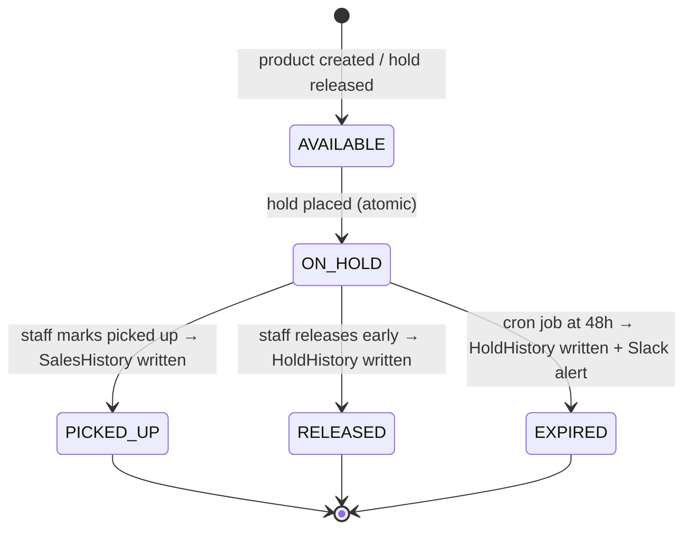

# Jays Shop — Architecture & Build Plan
> A no-payment merchandise reservation system for the Toronto Blue Jays store

---

## 1. Elevator Pitch

Jays Shop lets Blue Jays fans browse your full merchandise catalog online, place a free 48-hour hold on any item, and walk into the store to pay and pick it up — no credit card, no app download required.
For the store, every hold is a warm lead with a name and phone number attached: you see reservations in real time on a staff dashboard and get a Slack ping the moment a hold is placed.
Compared to "call us and hope," this turns intent into a guaranteed foot-traffic visit, captures inventory demand data, and builds a loyal customer list — all before a single dollar changes hands.
It's a modern reservation experience that meets fans where they are: on their phone.

---

## 2. Problem & Value Proposition

### The Status Quo Is Broken

| Scenario | Customer Pain | Store Pain |
|---|---|---|
| Call-ahead hold | Phone tag, no confirmation, staff reliant on memory | Untracked, no-shows go unlogged |
| First-come first-served | Drive in to find item gone | Lost sale, frustrated fan |
| No reservation option | Fans buy from MLB Shop instead | Zero capture of online demand |

### Why No-Payment Holds Win

- **Zero friction for the customer** — Name + phone is all they need. No account, no card, no app.
- **Guaranteed foot traffic** — A confirmed hold is a committed visit within 48 hours.
- **Inventory intelligence** — Every hold tells you which items are in demand before they sell out. Staff can reorder confidently.
- **Customer data capture** — Phone number = a real person the store can reconnect with.

### Quantified Hypothesis

Industry data for click-and-collect / reserve-in-store programs shows **60–80% conversion** from confirmed hold to in-store purchase (vs. ~2–5% for standard e-commerce browse-to-buy). With a 48-hour window and a free hold, there is no buyer's remorse before walking in — the customer has already decided.

---

## 3. Customer & Staff Experience

### Customer Journey

```
Browse /shop → Tap product → /shop/[slug] → Tap "Hold This Item — Free"
  → Modal: enter name + phone → POST /api/holds → Redirect to /holds/[code]
  → Show QR code + human-readable code → Walk in → Staff scans QR → Pickup confirmed
```

### Staff Journey

```
Slack ping (new hold) → Check /admin dashboard (live feed) → Customer arrives
  → Tap "Mark Picked Up" (dashboard or Slack button) → Hold resolved → SalesHistory written
```

### Key Screens (Mockup-Level)

**Screen 1 — Home / Landing (`/`)**
Navy hero banner: "Reserve Your Gear. Pick It Up Today." Large red CTA button → `/shop`. Below: 3-step explainer cards (Browse → Hold → Pick Up). FAQ accordion in royal blue band at bottom.

**Screen 2 — Shop Catalog (`/shop`)**
Sticky category pill row (All / Jerseys / Caps / Hoodies / Accessories). 2-column card grid on mobile, 4-column on desktop. Each card: product image (portrait aspect), status chip (green AVAILABLE / amber ON HOLD), item name in Oswald, CAD price in red.

**Screen 3 — Product Detail (`/shop/[slug]`)**
Full-bleed product image, overlaid status chip. Item name, CAD price, description. "Hold This Item — Free" CTA in Jays red (disabled state if ON HOLD). How-holds-work mini FAQ below.

**Screen 4 — Hold Modal (overlay on Screen 3)**
Bottom sheet on mobile, centered dialog on desktop. Two inputs: Full Name, Phone Number. Microcopy: "Free 48-hour hold — no credit card." Confirm Hold button → spinner → redirect.

**Screen 5 — Reservation Receipt (`/holds/[reservationId]`)**
Full-screen navy background. White receipt card: big reservation code in monospace (e.g., `JS-7H3K9`), QR code below in Jays navy. Product thumbnail + name + price. Customer name + expiry timestamp. Bottom strip: "Show this screen to a staff member when you arrive."

**Screen 6 — My Holds (`/account`)**
Phone number input + Look Up button. Results list: one card per active hold showing product name, price, code, status chip, and link to receipt.

**Screen 7 — Admin Dashboard (`/admin`)**
Split layout: left sidebar nav (Dashboard / Products / Holds / History / Reports / Settings). Main area: live hold feed (Supabase Realtime), each row showing product + customer + code + expiry countdown + "Mark Picked Up" / "Release" action buttons. Badge count for active holds.

**Screen 8 — Admin Holds Management (`/admin/holds`)**
Filterable table: all holds with status filter, date picker, search by phone or product. Bulk actions. Status chips color-coded.

**Screen 9 — Admin History (`/admin/history`)**
Immutable audit table of every completed hold. Filters: date range, finalStatus (PICKED_UP / RELEASED / EXPIRED), customer phone, product, resolved-by admin. Sortable columns. **CSV Export** button streams `/api/admin/history/export`.

**Screen 10 — Admin Reports (`/admin/reports`)**
Metrics dashboard with Recharts visualisations:
- Total holds placed (selected period) vs prior period
- Conversion rate: PICKED_UP / total holds placed (%)
- No-show rate: EXPIRED / total holds placed (%)
- Top 10 items held (by count)
- Top 10 items sold (by units and by CAD revenue)
- Weekly revenue trend bar chart (CAD)
- Per-customer no-show stats table (sortable by no-show rate)
CSV export of all report data.

---

## 4. Tech Stack

```mermaid
graph TD
  Browser["Browser / PWA"] -->|HTTPS| Vercel["Vercel Edge (Next.js 14)"]
  Vercel -->|Prisma ORM| DB[(Neon PostgreSQL (prod) / Docker Postgres (local))]
  Vercel -->|LISTEN/NOTIFY| Realtime["Postgres LISTEN/NOTIFY + SSE"]
  Vercel -->|Webhook| Slack["Slack Block Kit"]
  Vercel -->|Upload + optimize| Media["Local filesystem + sharp; optional Cloudflare R2"]
  Vercel -->|API call| OpenAI["OpenAI gpt-4o-mini"]
  Vercel -->|Cron /15min| Cron["Vercel Cron → expire-holds"]
  Realtime -->|Live updates| AdminDash["Admin Dashboard"]
```

| Layer | Choice | Rationale |
|---|---|---|
| **Framework** | Next.js 14 App Router + TypeScript | ISR for catalog pages, Server Actions for mutations, single deploy |
| **Styling** | Tailwind CSS + shadcn/ui | Utility-first, no runtime CSS-in-JS, shadcn gives accessible unstyled components |
| **PWA** | next-pwa (Workbox) | Service worker auto-generated; manifest drives install prompt; offline catalog cache |
| **Database** | Neon PostgreSQL (prod) / Docker Postgres (local) + Prisma | Docker Postgres keeps local dev self-contained; Neon provides managed production Postgres; Prisma gives type-safe queries and migration tooling |
| **Auth** | Phone + name only (no OTP in v1) | Zero cost, zero friction; phone is the identity key; OTP via Twilio Verify can be added in v2 for ~$0.05/verification |
| **Real-time** | Postgres LISTEN/NOTIFY + Server-Sent Events | Postgres-native push avoids a separate real-time vendor; SSE streams updates to the browser with low overhead |
| **Slack** | Incoming Webhook + Block Kit | Free; interactive buttons call back to `/api/slack/interactive` for pickup/release without opening dashboard |
| **Images** | Local filesystem + sharp; optional Cloudflare R2 | In-process sharp optimization avoids external dependencies in dev; optional R2 backend for serverless production storage |
| **QR code** | qrcode.react (client-side) | Zero server cost; renders instantly; works offline |
| **Chatbot** | OpenAI gpt-4o-mini | $0.15/1M input + $0.60/1M output tokens ≈ **$0.08–$0.40 per 1,000 chats**; cost-controlled via `max_tokens: 300` |
| **Hosting** | Vercel Hobby (free) | Zero-config Next.js deploy; cron jobs included |
| **Cron** | Vercel Cron (`vercel.json`) | Free on Hobby; runs every 15 min; simpler than database scheduled functions (no PL/pgSQL required) |
| **Currency** | `Intl.NumberFormat('en-CA', { style: 'currency', currency: 'CAD' })` | Native browser API, always correct CAD formatting |
| **React Native path** | Clean REST/JSON API surface | Every `/api/*` route returns JSON; a future React Native app reuses the same endpoints |

### PWA Strategy

- `public/manifest.json`: `display: standalone`, theme `#134A8E`, icons at 192×192 and 512×512
- `next-pwa` with `disable: process.env.NODE_ENV === 'development'` to avoid SW noise in dev
- Workbox `StaleWhileRevalidate` for uploaded product images (7-day cache, max 100 entries)
- Offline fallback: cached catalog renders from service worker; hold creation queues error message when offline

---

## 5. Design Direction

### Colour Tokens (Tailwind)

```js
jays: {
  navy:  '#134A8E',  // primary brand, headers, nav
  royal: '#1D2D5C',  // secondary, FAQ sections, chat header
  red:   '#E8291C',  // CTAs, prices, accents
  white: '#FFFFFF',
  ice:   '#F0F4FA',  // page background
  steel: '#64748B',  // body text, muted labels
}
```

### Typography

| Use | Font | Weight |
|---|---|---|
| Headings, labels, CTAs | **Oswald** (Google) | 600–700, `uppercase`, `tracking-wide` |
| Body, form labels, descriptions | **Inter** (Google) | 400–500 |

### Mobile-First Patterns

- **Bottom navigation bar** on mobile (56px height, safe-area-inset aware): Shop / My Holds / Chat
- **Bottom sheet modals** for the hold form on mobile (Radix Dialog with `align-end` on small viewports)
- Touch targets ≥ 44×44px on all interactive elements
- Product grid: 2 columns on mobile → 3 sm → 4 lg
- Receipt page: full-bleed navy background, centered white card — feels like a boarding pass

### Component Language

| Component | Description |
|---|---|
| `<ProductCard>` | Portrait-ratio image, status chip overlay top-right, Oswald name, red price |
| `<StatusChip>` | Pill badge: green=AVAILABLE, amber=ON HOLD, gray=SOLD/ARCHIVED |
| `<HoldButton>` | Full-width red CTA; disabled state shows "Currently Reserved" |
| `<QRCodeDisplay>` | White padded card around `<QRCodeSVG fgColor="#134A8E">` |
| `<ChatFAB>` | Royal blue floating button, bottom-right, opens Birdie chat drawer |

---

## 6. Information Architecture & Routes

### Public Routes

| Route | Component | Description |
|---|---|---|
| `/` | `page.tsx` | Landing: hero, how-it-works, FAQ |
| `/shop` | `shop/page.tsx` | Catalog grid with category filter (ISR 60s) |
| `/shop/[slug]` | `shop/[slug]/page.tsx` | Product detail + HoldButton (ISR 30s) |
| `/holds/[reservationId]` | `holds/[reservationId]/page.tsx` | QR receipt |
| `/account` | `account/page.tsx` | Phone lookup → active holds list |

### Admin Routes

| Route | Description |
|---|---|
| `/admin` | Live hold activity dashboard (Supabase Realtime) |
| `/admin/products` | Product management (upload via Cloudinary, edit, archive) |
| `/admin/holds` | All holds — filterable, sortable, bulk actions |
| `/admin/history` | Immutable hold history — filters: date, status, phone, product, admin; CSV export |
| `/admin/reports` | Metrics: conversion rate, no-show rate, revenue trends, top items |
| `/admin/notifications` | Slack webhook settings, test ping |

### API Routes (Route Handlers)

| Method + Path | Purpose |
|---|---|
| `GET /api/products` | List products (filterable) |
| `GET /api/products/[slug]` | Single product |
| `POST /api/holds` | Create hold (atomic) + Slack notify |
| `GET /api/holds/[reservationId]` | Fetch hold + product + customer |
| `PATCH /api/holds/[reservationId]` | `{ action: "pickup" \| "release", adminId? }` |
| `GET /api/customers/[phone]/holds` | Customer hold lookup by phone |
| `POST /api/admin/products` | Admin: create product |
| `PATCH /api/admin/products/[id]` | Admin: update / archive |
| `GET /api/admin/history` | Hold history with query filters |
| `GET /api/admin/history/export` | CSV stream of hold history |
| `GET /api/admin/reports` | Aggregated metrics JSON |
| `POST /api/cron/expire-holds` | Vercel Cron (Bearer token protected) |
| `POST /api/slack/interactive` | Slack button callback (pickup / release) |
| `POST /api/chat` | Birdie AI assistant |

---

## 7. Data Model

```prisma
// prisma/schema.prisma

enum ProductStatus { AVAILABLE  ON_HOLD  SOLD  ARCHIVED }
enum HoldStatus    { ACTIVE  PICKED_UP  RELEASED  EXPIRED }
enum AdminRole     { OWNER  STAFF }

model Product {
  id          String        @id @default(cuid())
  name        String
  slug        String        @unique
  description String?
  priceCents  Int                        // CAD cents, e.g. 14999 = $149.99
  imageUrl    String
  category    String        @default("general")
  status      ProductStatus @default(AVAILABLE)
  createdAt   DateTime      @default(now())
  updatedAt   DateTime      @updatedAt
  holds       Hold[]
  @@index([status])
  @@index([category])
}

model Customer {
  id        String   @id @default(cuid())
  fullName  String
  phone     String   @unique           // identity key for v1
  createdAt DateTime @default(now())
  holds     Hold[]
  @@index([phone])
}

model Hold {
  id              String     @id @default(cuid())
  reservationCode String     @unique  // e.g. JS-7H3K9
  productId       String
  customerId      String
  status          HoldStatus @default(ACTIVE)
  placedAt        DateTime   @default(now())
  expiresAt       DateTime               // placedAt + 48h
  pickedUpAt      DateTime?
  releasedAt      DateTime?
  notifiedStaffAt DateTime?
  product         Product    @relation(fields: [productId], references: [id])
  customer        Customer   @relation(fields: [customerId], references: [id])
  @@index([productId, status])           // enforces one ACTIVE per product
  @@index([status, expiresAt])           // cron query index
  @@index([customerId])
}

model Admin {
  id           String    @id @default(cuid())
  email        String    @unique
  passwordHash String
  role         AdminRole @default(STAFF)
  createdAt    DateTime  @default(now())
  resolvedHolds HoldHistory[]
  sales         SalesHistory[]
  auditLogs     AuditLog[]
}

model SlackSettings {
  id                 String  @id @default(cuid())
  webhookUrl         String
  channelName        String
  interactiveEnabled Boolean @default(false)
}

// ─── IMMUTABLE HISTORY TABLES ──────────────────────────────────────────────
//
// WHY SNAPSHOTS: A Product's name, price, or image can be edited or the
// product can be archived/deleted after a transaction closes. Snapshot fields
// preserve the exact state at transaction time so history records remain
// accurate forever — independent of any future edits to the live catalog.
//
// RETENTION POLICY: Rows are NEVER hard-deleted. After a configurable
// retention window (default: 24 months) rows are soft-archived by setting
// archivedAt. Queries default to WHERE archivedAt IS NULL.

model HoldHistory {
  id              String  @id @default(cuid())
  holdId          String? @unique            // nullable: survives hold deletion

  reservationCode String

  // Product snapshot — preserved even if product is later edited or deleted
  productId                 String?
  productNameSnapshot       String
  productPriceCentsSnapshot Int              // CAD cents
  productImageUrlSnapshot   String

  // Customer snapshot — preserved even if customer record is modified
  customerId            String?
  customerNameSnapshot  String
  customerPhoneSnapshot String

  placedAt    DateTime
  expiresAt   DateTime
  finalStatus String                         // PICKED_UP | RELEASED | EXPIRED
  resolvedAt  DateTime

  resolvedByAdminId String?                  // null = system (cron) or customer-triggered
  notes             String?
  archivedAt        DateTime?                // soft-archive, never hard-delete

  resolvedBy Admin? @relation(fields: [resolvedByAdminId], references: [id])

  @@index([finalStatus])
  @@index([resolvedAt])
  @@index([customerPhoneSnapshot])
  @@index([productId])
  @@index([resolvedByAdminId])
  @@index([archivedAt])
}

model SalesHistory {
  id              String @id @default(cuid())
  holdId          String
  reservationCode String

  // Product snapshot
  productId              String?
  productNameSnapshot    String
  salePriceCentsSnapshot Int              // CAD cents — price at time of sale

  // Customer snapshot
  customerId            String?
  customerPhoneSnapshot String

  soldAt        DateTime
  soldByAdminId String?                  // which staff member confirmed pickup

  soldBy Admin? @relation(fields: [soldByAdminId], references: [id])

  @@index([soldAt])
  @@index([soldByAdminId])
  @@index([productId])
  @@index([customerPhoneSnapshot])
}

model AuditLog {
  id         String   @id @default(cuid())
  action     String                         // e.g. "hold.created", "hold.picked_up"
  entityType String
  entityId   String
  actorId    String?
  actorType  String?                        // "admin" | "customer" | "system"
  payload    Json                           // snapshot of relevant data at time of action
  createdAt  DateTime @default(now())
  actor Admin? @relation(fields: [actorId], references: [id])
  @@index([entityType, entityId])
  @@index([createdAt])
  @@index([actorId])
}
```

**Money rule:** all prices stored as integer cents (CAD). Format for display: `Intl.NumberFormat('en-CA', { style: 'currency', currency: 'CAD' })`.

---

## 8. Reservation Engine

### State Machine



### Race-Condition-Safe Hold Creation

**Strategy: Unique partial index + Prisma transaction**

```sql
-- Migration: prevents two ACTIVE holds on the same product
CREATE UNIQUE INDEX holds_product_active_unique
  ON "Hold" ("productId")
  WHERE status = 'ACTIVE';
```

The application code optimistically creates the hold inside a transaction. If two concurrent requests race, PostgreSQL enforces the unique partial index and one throws `P2002` (unique constraint violation), which the API translates to a `409 ITEM_ALREADY_ON_HOLD` response.

```ts
// src/lib/holds/createHold.ts (core logic)
export async function createHold(productId: string, customer: { fullName: string; phone: string }) {
  const cx = await prisma.customer.upsert({
    where: { phone: customer.phone },
    update: { fullName: customer.fullName },
    create: { ...customer },
  })

  // Rate limit: max 3 active holds per customer
  const activeCount = await prisma.hold.count({
    where: { customerId: cx.id, status: 'ACTIVE' },
  })
  if (activeCount >= 3) throw new Error('HOLD_LIMIT_REACHED')

  const product = await prisma.product.findUniqueOrThrow({ where: { id: productId } })
  if (product.status !== 'AVAILABLE') throw new Error('ITEM_NOT_AVAILABLE')

  try {
    return await prisma.$transaction(async (tx) => {
      const hold = await tx.hold.create({
        data: {
          reservationCode: generateReservationCode(),
          productId,
          customerId: cx.id,
          expiresAt: new Date(Date.now() + 48 * 60 * 60 * 1000),
        },
        include: { product: true, customer: true },
      })
      await tx.product.update({ where: { id: productId }, data: { status: 'ON_HOLD' } })
      await tx.auditLog.create({ data: { action: 'hold.created', entityType: 'Hold',
        entityId: hold.id, actorType: 'customer', actorId: cx.id,
        payload: { reservationCode: hold.reservationCode, productNameSnapshot: product.name } } })
      return hold
    })
  } catch (err) {
    if (err instanceof Prisma.PrismaClientKnownRequestError && err.code === 'P2002') {
      throw new Error('ITEM_ALREADY_ON_HOLD')
    }
    throw err
  }
}
```

### Hold Resolution — HoldHistory + SalesHistory written in the same transaction

```ts
// src/lib/holds/resolveHold.ts (core logic)
export async function resolveHold(
  holdId: string,
  finalStatus: 'PICKED_UP' | 'RELEASED' | 'EXPIRED',
  adminId?: string
) {
  const hold = await prisma.hold.findUniqueOrThrow({
    where: { id: holdId }, include: { product: true, customer: true },
  })
  if (hold.status !== 'ACTIVE') throw new Error('HOLD_NOT_ACTIVE')
  const now = new Date()

  await prisma.$transaction(async (tx) => {
    // 1. Resolve the hold
    await tx.hold.update({ where: { id: holdId }, data: {
      status: finalStatus,
      ...(finalStatus === 'PICKED_UP' && { pickedUpAt: now }),
      ...(finalStatus === 'RELEASED'  && { releasedAt: now }),
    }})

    // 2. Update product availability
    await tx.product.update({ where: { id: hold.productId },
      data: { status: finalStatus === 'PICKED_UP' ? 'SOLD' : 'AVAILABLE' },
    })

    // 3. Write immutable HoldHistory snapshot — ALWAYS, for all transitions
    await tx.holdHistory.create({ data: {
      holdId,
      reservationCode: hold.reservationCode,
      productId: hold.productId,
      productNameSnapshot:       hold.product.name,        // snapshot at transaction time
      productPriceCentsSnapshot: hold.product.priceCents,  // snapshot at transaction time
      productImageUrlSnapshot:   hold.product.imageUrl,    // snapshot at transaction time
      customerId: hold.customerId,
      customerNameSnapshot:  hold.customer.fullName,       // snapshot at transaction time
      customerPhoneSnapshot: hold.customer.phone,          // snapshot at transaction time
      placedAt: hold.placedAt,
      expiresAt: hold.expiresAt,
      finalStatus,
      resolvedAt: now,
      resolvedByAdminId: adminId ?? null,
    }})

    // 4. Write SalesHistory — ONLY on PICKED_UP
    if (finalStatus === 'PICKED_UP') {
      await tx.salesHistory.create({ data: {
        holdId,
        reservationCode: hold.reservationCode,
        productId: hold.productId,
        productNameSnapshot:    hold.product.name,        // snapshot
        salePriceCentsSnapshot: hold.product.priceCents,  // price at time of sale
        customerId: hold.customerId,
        customerPhoneSnapshot: hold.customer.phone,       // snapshot
        soldAt: now,
        soldByAdminId: adminId ?? null,
      }})
    }

    // 5. Audit log entry
    await tx.auditLog.create({ data: { action: `hold.${finalStatus.toLowerCase()}`,
      entityType: 'Hold', entityId: holdId,
      actorType: adminId ? 'admin' : 'system', actorId: adminId ?? null,
      payload: { reservationCode: hold.reservationCode,
        productNameSnapshot: hold.product.name,
        productPriceCentsSnapshot: hold.product.priceCents,
        customerPhoneSnapshot: hold.customer.phone } } })
  })
}
```

### 48h Expiry Cron

`POST /api/cron/expire-holds` — secured with `Authorization: Bearer $CRON_SECRET`

```
Runs every 15 minutes via vercel.json:
  SELECT holds WHERE status = ACTIVE AND expiresAt <= NOW()
  FOR EACH:
    resolveHold(id, 'EXPIRED')          → writes HoldHistory, sets product AVAILABLE
    sendSlackExpiry(...)                → staff Slack alert only (no customer notification)
```

### Business Rules Summary

| Rule | Implementation |
|---|---|
| One ACTIVE hold per item | Unique partial index on `(productId) WHERE status='ACTIVE'` |
| Max 3 active holds per customer | Count check before transaction |
| Snapshot required on every close | `holdHistory.create` inside every `resolveHold` transaction |
| SalesHistory only on pickup | Conditional inside same transaction |
| No customer nag on expiry | Cron alerts Slack only |
| History never hard-deleted | No `delete` on history tables; `archivedAt` for soft-archive only |

---

## 9. Notifications

### Supabase Realtime (Admin Dashboard)

```ts
const channel = supabase
  .channel('holds-feed')
  .on('postgres_changes', { event: '*', schema: 'public', table: 'Hold' }, (payload) => {
    // Update live feed state
  })
  .subscribe()
```

Requires `REPLICA IDENTITY FULL` on the `Hold` table in Supabase (one SQL command in the Supabase SQL editor).

### Slack Block Kit — New Hold

```json
{
  "blocks": [
    { "type": "header", "text": { "type": "plain_text", "text": "🔔 New Hold Placed — Jays Shop" } },
    {
      "type": "section",
      "fields": [
        { "type": "mrkdwn", "text": "*Product:*\nVlad Jr. Authentic Jersey" },
        { "type": "mrkdwn", "text": "*Price:*\n$189.99 CAD" },
        { "type": "mrkdwn", "text": "*Customer:*\nJordan Martinez" },
        { "type": "mrkdwn", "text": "*Phone:*\n416-555-0123" },
        { "type": "mrkdwn", "text": "*Reservation Code:*\n`JS-7H3K9`" },
        { "type": "mrkdwn", "text": "*Expires:*\nFri, May 24 at 3:45 PM ET" }
      ],
      "accessory": {
        "type": "image",
        "image_url": "https://res.cloudinary.com/.../vlad-jr-jersey",
        "alt_text": "Vlad Jr. Jersey"
      }
    },
    {
      "type": "actions",
      "elements": [
        { "type": "button", "text": { "type": "plain_text", "text": "Mark Picked Up" },
          "style": "primary", "action_id": "hold_pickup", "value": "JS-7H3K9" },
        { "type": "button", "text": { "type": "plain_text", "text": "Release Now" },
          "style": "danger", "action_id": "hold_release", "value": "JS-7H3K9" }
      ]
    }
  ]
}
```

### Slack Block Kit — Expiry Alert (cron-triggered, staff only)

```json
{
  "blocks": [{
    "type": "section",
    "text": {
      "type": "mrkdwn",
      "text": "⏰ *Hold Expired* — `JS-7H3K9`\n*Vlad Jr. Authentic Jersey* ($189.99 CAD) held by Jordan Martinez (416-555-0123) was not picked up. Item is back on the shelf."
    }
  }]
}
```

### Slack Interactive Buttons

Slack posts `action_id` + `value` to `POST /api/slack/interactive`. The endpoint verifies the Slack signing secret, extracts the reservation code from `value`, and calls `resolveHold()`.

---

## 10. Chatbot (Birdie)

### Scope
- Answers: product questions, catalog navigation, how holds work, store policies
- Refuses: placing/cancelling orders, off-topic requests, price negotiation
- Uses real-time catalog (fetched server-side per request, max 30 products)

### Architecture

```
Client: ChatFAB (React, conversation state in useState)
  → POST /api/chat { messages: Message[] }
    → Fetch live product catalog from DB (server-side)
    → Build system prompt with catalog + FAQ
    → openai.chat.completions.create({ model: 'gpt-4o-mini', max_tokens: 300 })
    → Return { reply: string }
```

### System Prompt Strategy

The system prompt is rebuilt on every request with:
1. Static FAQ (hold rules, store policies)
2. Live product catalog summary (name + category + price + status) — injected fresh so Birdie always knows current availability

Conversation history is kept in client-side React state and sent as the `messages` array — no server-side session storage needed.

### Guardrails

The system prompt instructs Birdie to:
- Never place, modify, or cancel holds (direct users to the shop page)
- Never discuss topics outside Jays Shop / Blue Jays merchandise
- Refuse requests to override store policies

### Cost Estimate

`gpt-4o-mini`: $0.15 / 1M input tokens + $0.60 / 1M output tokens.
Average chat turn: ~500 input tokens (catalog + history) + ~100 output tokens.
Per 1,000 sessions (5 turns each): ~$0.075–$0.38 total. **Effectively negligible at launch volume.**

---

## 11. Phased Roadmap

### P1 — Foundation
**Scope:** Next.js 14 scaffold, TypeScript, Tailwind, Blue Jays design tokens, shadcn/ui, PWA manifest + service worker, layout shell (header, bottom nav), landing page.

**Acceptance Criteria:**
- [ ] Dev server runs at `localhost:3000`
- [ ] Lighthouse PWA score ≥ 90 (Chrome DevTools)
- [ ] App is installable on Android Chrome
- [ ] Brand colours and Oswald/Inter fonts render correctly
- [ ] Bottom nav visible on mobile viewport

---

### P2 — Catalog
**Scope:** Prisma schema + Supabase migration, 14 seeded Blue Jays products, admin product upload UI (Cloudinary), public `/shop` grid + `/shop/[slug]` detail page, CAD pricing.

**Acceptance Criteria:**
- [ ] `npm run db:push` creates all tables including `HoldHistory` and `SalesHistory`
- [ ] `npm run db:seed` populates 14 products
- [ ] `/shop` renders product grid with category filters
- [ ] Admin can add a product in < 2 minutes via Cloudinary upload widget
- [ ] Prices display in correct CAD format (`$189.99`)

---

### P3 — Holds + History Capture
**Scope:** Phone-based customer identity, atomic hold creation (`createHold`), race-condition safety (unique partial index), receipt page with QR code + reservation ID, `/account` phone lookup, `resolveHold` writes `HoldHistory` + `SalesHistory` snapshots in every state transition.

**Acceptance Criteria:**
- [ ] Two simultaneous hold attempts on same item → only one succeeds, other gets 409
- [ ] Hold creation respects 3-hold-per-customer limit
- [ ] QR code renders on mobile and encodes the correct URL
- [ ] `HoldHistory` row is written in the same DB transaction as every status change
- [ ] `SalesHistory` row is written (same transaction) on PICKED_UP only
- [ ] All snapshot fields (name, price, image, customer name/phone) are populated

---

### P4 — Admin Dashboard + Real-time + Slack + History UI
**Scope:** Staff dashboard with live hold feed (Supabase Realtime), mark-picked-up and release actions with admin attribution, Slack incoming webhook + Block Kit, optional interactive buttons, `/admin/history` page with full filters and **CSV export**.

**Acceptance Criteria:**
- [ ] Slack message arrives < 5s after hold is placed
- [ ] Dashboard updates without page refresh when a hold is placed
- [ ] Admin can mark picked up → updates Hold status + writes SalesHistory
- [ ] Admin can release → updates Hold status + writes HoldHistory
- [ ] `/admin/history` filters by date range, finalStatus, customer phone, product, admin
- [ ] CSV export downloads a correct `.csv` of the filtered result set
- [ ] `resolvedByAdminId` is populated correctly in HoldHistory for staff-triggered resolutions

---

### P4.5 — Reports Dashboard
**Scope:** `/admin/reports` metrics page + `/api/admin/reports` endpoint + CSV export.

**Acceptance Criteria:**
- [ ] Reports page shows: total holds, conversion rate, no-show rate, top 10 held, top 10 sold (units + CAD revenue), weekly revenue trend
- [ ] Per-customer no-show stats table is sortable
- [ ] All metrics are computed from `SalesHistory` and `HoldHistory` (not live Hold table)
- [ ] Date range picker correctly filters all metrics
- [ ] CSV export downloads a correct summary `.csv`

---

### P5 — 48h Expiry Job + Chatbot
**Scope:** Vercel Cron at `/api/cron/expire-holds` (every 15 min), expiry writes HoldHistory + Slack alert + AuditLog; Birdie chat widget on all public pages.

**Acceptance Criteria:**
- [ ] Test hold with 5-minute window expires correctly in dev (override `expiresAt`)
- [ ] Slack expiry alert fires; no notification sent to customer
- [ ] `HoldHistory.finalStatus = 'EXPIRED'` and `resolvedByAdminId = null` for cron-expired holds
- [ ] Chat answers "how do holds work" correctly
- [ ] Chat refuses to place a hold when asked

---

### P6 — Deploy + Smoke Test
**Scope:** Vercel production deploy + Supabase prod project, env vars, optional custom domain, PWA verified iOS/Android, end-to-end smoke test.

**Acceptance Criteria:**
- [ ] Full smoke test: browse → place hold → QR receipt → admin sees it in dashboard → Slack ping arrives → mark picked up → `SalesHistory` row exists → `HoldHistory` row exists
- [ ] PWA installable on iOS Safari (Add to Home Screen) and Android Chrome
- [ ] Lighthouse performance ≥ 80 on mobile (3G simulated)
- [ ] All env vars set in Vercel project settings
- [ ] CAD formatting correct in production

---

## 12. Risks & Open Questions

| Risk | Likelihood | Mitigation |
|---|---|---|
| **Phone abuse / fake reservations** | Medium | Rate limit: max 3 active holds per phone. Flag phones with > 50% no-show rate in `/admin/reports`. Add Twilio Verify OTP in v2. |
| **No-show abuse** | Low-Medium | Track per-customer no-show rate in Reports. Admin can manually release holds. Block repeat no-show customers manually in v1. |
| **Slack workspace not set up** | High (pre-launch) | Store must provide webhook URL + channel name before P4 acceptance test. Config stored in `SlackSettings` table. |
| **Cloudinary account needed** | High (pre-launch) | Free tier is sufficient for launch. Store creates account and provides credentials. |
| **OpenAI API key** | Low | Optional in v1 — chat widget degrades gracefully if key missing. |
| **PIPEDA (Canadian privacy law)** | Medium | Phone numbers are PII. Required: (1) Add privacy policy page before launch. (2) Apply configurable retention window (default: **24 months**) to `HoldHistory` + `SalesHistory` — rows are never hard-deleted within the window; soft-archived by setting `archivedAt` after the window. (3) Provide admin a way to pseudonymize snapshot fields on Right-to-Erasure request. |
| **next@14.2.29 security advisory** | Low | Upgrade to latest 14.x patch before production deploy. |

### Monthly Cost Estimate (at launch volume)

| Service | Free Tier | Paid Trigger |
|---|---|---|
| Vercel (Hobby) | Free | > 100GB bandwidth → Pro $20/mo |
| Supabase (Free) | 500MB DB, 1GB storage | > limits → Pro $25/mo |
| Cloudinary | 25 GB storage | > 25GB → ~$89/mo (unlikely at launch) |
| OpenAI | Pay-as-you-go | ~$0–$5/month at low chat volume |
| Twilio Verify (v2) | $0.05/SMS | Only when OTP is added |
| **Total at launch** | **~$0–$5/month** | |

---

## 13. Why This Wins

Blue Jays fans are loyal, mobile-first, and ready to buy — they just need a reason to walk through the door. Jays Shop gives them exactly that: a frictionless, no-payment hold experience that takes 30 seconds on their phone and guarantees a visit to the store within 48 hours. For the store manager, every hold is a data point — which items are in demand, which customers are regulars, what's selling and what's sitting — all visible in real time on a staff dashboard with a Slack ping the moment action is required. The permanent history and reports system means you can walk into any conversation with ownership or investors and show exactly what sold, when, and to whom, with zero data gaps — and because every history row stores a snapshot of the product and customer at transaction time, your records stay accurate even as the catalog evolves. This is not a complex build: six focused phases, a modern free-tier stack, and a $0/month launch cost. The first hold placed will pay for the entire system.

---

*Plan version: 2.0 — History & Accountability integrated*
*Generated for Jays Shop, Toronto Blue Jays merchandise store*
*Stack: Next.js 14 · TypeScript · Tailwind · PostgreSQL (Neon/Docker) · Prisma · Vercel · Slack · OpenAI*
